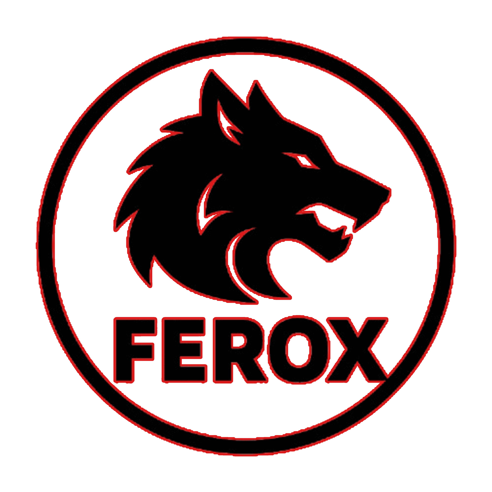

# FEROX

This repository contains the FEROX fitness application.

## Conventions
- Use `npm install` to install Node dependencies.
- Run `npm test` before committing, even if tests are currently placeholders.
- Use `npm start` to run the development server.

## Scope
These instructions apply to the entire repository.
